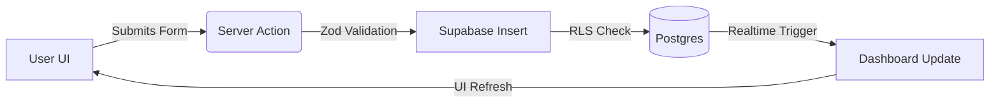

# 🌌 ANTIGRAVITY (LifeOS) | Full Codebase Walkthrough

Antigravity is a high-performance, aesthetically-driven **Personal Life Tracking OS** built with Next.js, Supabase, and AI. It serves as a unified digital brain for managing tasks, habits, goals, finances, and knowledge through a seamless, interactive interface.

---

## 1. 🛠 TECH STACK OVERVIEW

| Layer | Technology | Rationale |
|---|---|---|
| **Framework** | [Next.js 16 (App Router)](https://nextjs.org/) | Hybrid SSR/Static streaming for performance & server actions for simple backend logic. |
| **Language** | [TypeScript](https://www.typescriptlang.org/) | Strict type safety across frontend and backend. |
| **Database** | [Supabase (PostgreSQL)](https://supabase.com/) | Real-time capabilities, robust RLS policies, and managed auth. |
| **Aesthetics** | [Tailwind CSS](https://tailwindcss.com/) + [shadcn/ui](https://ui.shadcn.com/) | Consistent design system with custom premium components (Spotlight, Magnetic). |
| **Animations** | [Framer Motion](https://www.framer.com/motion/) | Smooth entrance animations and micro-interactions. |
| **Charts** | [Recharts](https://recharts.org/) | Responsive and customizable data visualization. |
| **Logic** | [Zod](https://zod.dev/) | Schema validation for forms and API requests. |
| **AI** | [Groq (Llama-3.3-70b)](https://groq.com/) | Ultra-fast inference with fallback to Local AI (LM Studio). |

---

## 2. 🗺 PROJECT MAP

### 📁 Directory Structure
- `/app`: Main routes and Server Actions.
- `/components`: UI library, organized by feature (tasks, habits, etc.) and general UI primitives.
- `/lib`: Supabase clients, AI context building logic, and shared utilities.
- `/supabase`: Database schema, migrations, and RLS policy definitions.
- `/types`: Project-wide TypeScript interfaces.
- `middleware.ts`: Site-wide session management and device detection.

### 🌐 Page & Route Map
| Route | Purpose | Key Components | Supabase Tables |
|---|---|---|---|
| `/dashboard` | Daily Overview | Bento Grid, Progress, Stats | `tasks`, `habits`, `goals`, `transactions` |
| `/dashboard/tasks` | Kanban/List Task Manager | `TaskBoard`, `TaskList` | `tasks`, `team_members` |
| `/dashboard/habits` | Habit Logs & Streaks | `HabitList`, `HabitAnalytics` | `habits`, `habit_logs` |
| `/dashboard/goals` | Long-term Progress | `GoalsManager`, `ProgressBar` | `goals` |
| `/dashboard/finances` | Income/Expense Tracking | `FinanceManager`, `Recharts` | `transactions`, `categories` |
| `/dashboard/notes` | Rich Text Journaling | `NoteEditor`, `NoteCard` | `notes` |
| `/dashboard/resources`| Knowledge Library | `ResourceCard`, `3D Viewer` | `resources`, `collections` |
| `/dashboard/teams` | Collaboration Hub | `TeamList`, `Invites` | `teams`, `memberships` |
| `/dashboard/chat` | Real-time Communication | `ChatInterface`, `SharedItems`| `team_messages`, `realtime` |
| `/dashboard/roadmaps` | Visual Planning | `RoadmapCanvas`, `StepNodes` | `roadmaps`, `steps` |

---

## 3. 💾 DATABASE MAP (Supabase)

### 📊 Granular Database Schema
The database uses **PostgreSQL** on Supabase. Row Level Security (RLS) is enabled on all tables, ensuring users only see their own data (`auth.uid() = user_id`).

#### Core Tables
- **`users`**: Extended profile data.
  - Columns: `id` (uuid, PK), `email` (text), `name` (text), `role` (text), `created_at`.
- **`collections`**: Generic grouping for resources and notes.
  - Columns: `id`, `user_id`, `name`, `description`, `icon`, `color`.

#### Productivity & Life Tracking
- **`tasks`**: Main to-do list.
  - Columns: `id`, `user_id`, `title`, `description`, `priority` (Low/Med/High/Urgent), `status` (Todo/In Progress/Done), `due_date`, `completed_at`, `completion_reason`, `assigned_to`, `created_at`.
- **`habits`**: Recurring actions.
  - Columns: `id`, `user_id`, `name`, `frequency` (Daily/Weekly), `created_at`.
- **`habit_logs`**: Daily completion tracking.
  - Columns: `id`, `habit_id` (FK), `date` (date), `status` (boolean), `created_at`.
- **`goals`**: Target tracking.
  - Columns: `id`, `user_id`, `title`, `target_value`, `current_value`, `unit`, `deadline`, `type` (Short/Mid/Long Term).

#### Finance
- **`transactions`**: Income/Expense records.
  - Columns: `id`, `user_id`, `amount`, `type` (Income/Expense), `category_name`, `description`, `date`.
- **`categories`**: Financial categories.
  - Columns: `id`, `user_id`, `name`, `type` (Income/Expense), `icon`.

#### Knowledge & Learning
- **`notes`**: Rich text entries.
  - Columns: `id`, `user_id`, `collection_id` (FK), `title`, `content`, `created_at`.
- **`resources`**: Links, files, and 3D models.
  - Columns: `id`, `user_id`, `collection_id` (FK), `title`, `url`, `type` (URL/File/3D), `summary`, `tags` (text[]), `file_path`, `created_at`.
- **`learning_paths`**: Structured courses.
  - Columns: `id`, `user_id`, `title`, `is_completed`, `progress`.

#### Teams & Roadmaps
- **`teams`**: Collaboration groups.
- **`team_members`**: Link users to teams with roles (Owner/Admin/Member).
- **`roadmaps`**: Visual branching journeys.
  - Columns: `id`, `owner_id`, `title`, `description`, `is_public`.
- **`roadmap_steps`**: Individual nodes in a roadmap.
- **`roadmap_step_links`**: Relationships between roadmap steps (Dependencies).

---

## 4. 🧩 COMPONENT ARCHITECTURE

### Key Feature Managers
| Component | Location | State Management | Critical Props |
|---|---|---|---|
| `TaskBoard` | `/components/tasks` | Local dialog states (`editingTask`, `completingTask`) | `tasks: Task[]` |
| `HabitsManager` | `/components/habits` | Optimistic updates for completions | None (Server Component parent) |
| `FinanceManager` | `/components/finances`| Transaction filtering logic | `initialData: any` |
| `GoalManager` | `/components/goals` | Progress bar calculations | `goals: Goal[]` |
| `NoteEditor` | `/components/notes` | Form state for title/content | `initialNote?: Note` |

### Premium UI Primitives (`/components/ui`)
- **`SpotlightCard`**: Ambient hover glow effect.
- **`MagneticText`**: Text that follows the cursor slightly.
- **`Entrance`**: Wrapper for Framer Motion entrance animations.
- **`HoverEffect`**: Reusable hover states (Lift, Glow, Border).

---

## 7. 🤖 MULTI-AGENT AI ARCHITECTURE (V2)

The AI Assistant has been refactored from a single-agent monolith to a **Multi-Agent Orchestration System**. This allows for complex, multi-step intent fulfillment.

### 🧠 The Orchestration Loop
1. **Mother Agent (Orchestrator)**: Analyzes the user's message and decides which specialized agents to call.
2. **Execution Loop**: The system iterates through the selected agents sequentially.
3. **Context Passing**: Each subsequent agent knows what the previous agents did (e.g., the Task Agent knows which Goal the Goal Agent just created).
4. **Final Summary**: The system merges results and provides a consolidated response.

### 👥 The Agent Squad
| Agent | Role | Capability |
|---|---|---|
| **Mother Agent** | Orchestrator/Direct Executor | **Directly fulfill 80% of requests** or delegate complex plans. |
| **Productivity Agent**| Life Manager | Handles **Tasks, Habits, and Goals** in a single multi-tool pass. |
| **Finance Agent** | Specialist | Records income and expenses. |
| **Summary Agent**| Read-only | Answers questions about existing data. |
| **Navigator Agent**| Router | Handles hands-free page navigation. |

### ✨ Multi-Step Optimization
- **Old Flow**: Mother -> Goal -> Task -> Habit (4 API calls)
- **New Flow**: Mother -> Productivity (2 API calls)
- **Simple Flow**: Mother directly calls `create_task` (1 API call)
- **Result**: Up to 75% faster for common life-tracking actions.

### 🚀 V_1.1 Industry-Standard Landing Page
- **Conversion Funnel**: 10-section structure (Sticky Nav, Hero, Social Proof, How-it-works, Pricing, etc.).
- **Onyx Aesthetics**: Absolute obsidian black surfaces with polished titanium accents.
- **Premium Interaction**: Integrated **SmoothScroll (Lenis)** for weighted physical scrolling.

### 🎨 Onyx Professional UI Upgrade (V_1.1)
- **Obsidian Depth**: Implemented an absolute **Onyx Black** base surface for maximum focus and power.
- **Metallic Accents**: Transitioned from vibrant colors to a sophisticated **Silver**, **Titanium**, and **Chrome** accent system.
- **Obsidian Glass**: Refined glassmorphism with crystal-clear transparencies and narrowed metallic border strokes.
- **Executive Typography**: Dramatic pairing of **Syne** (Display) and **Plus Jakarta Sans** (Body) with tightened tracking for high gravity.

### 🛠️ AI Task Management Refinements
- **Smart Bulk Completion**: The `mark_complete` tool now supports a `bulk: true` parameter to finish all tasks at once.
- **Zero-ID Interface**: The AI is now strictly forbidden from asking users for Task IDs. It automatically retrieves IDs from the context or uses bulk mode.
- **Feature Guardrails**: Updated system prompts with strict rules to prevent confusion between **Tasks** (todo list) and **Notes** (content).

### 🏷️ V_1.1 Milestone
- **Onyx Identity**: The assistant is now officially **V_1.1 (Onyx Professional)**.
- **Branded Avatars**: Integrated high-end metallic V icons across all message bubbles.
- **Executive Context**: Updated the header and descriptions to reflect "Professional Power & Focus".

### 📱 Onyx Responsive UI (XS to XL)
- **Immersive Monolith (XS/S)**: Transitioned to a full-screen monolith mode with centered layouts and touch-optimized executive padding.
- **Obsidian command center (L/XL)**: Expanded widths and asymmetric compositions for desktop, utilizing layered obsidian glass.
- **Precision Momentum**: Physically accurate smooth scrolling for a premium, weighted feel.

---

## 8. 🔐 AUTH & DATA FLOW

### 🚪 Authentication Flow
1. **Signup**: User submits email/password. PKCE flow triggers. A record is created in `public.users` via a trigger on `auth.users`.
2. **Session**: Handled by `@supabase/ssr`. 
3. **Middleware**: `middleware.ts` runs on every request to refresh the session and check if the user is authenticated for `/dashboard/*` routes. It also injects an `x-device-type` header for responsive optimizations.

### 🔄 Data Flow Example (New Task)

---

## 6. 🛠 WHAT TO BUILD NEXT (Priority List)

### 🔴 High Priority (Critical)
- **Search Consolidation**: Implement a global command palette (Cmd+K) that searches across all tables (tasks, notes, resources) using the existing search components.
- **Analytics Depth**: Transition from placeholder/static charts to dynamic multi-period aggregations (Weekly vs Monthly growth).

### 🟡 Medium Priority (Easy Wins)
- **AI Auto-Summaries**: Automatically trigger an AI summary when a URL resource is added.
- **Roadmap Templates**: Pre-built roadmap structures for common goals (e.g., "Learn React", "Financial Freedom").

### 🟢 Low Priority (New Features)
- **3D Workspace**: Enhance the 3D viewer in Resources to allow "pinning" 3D models to specific collections.
- **Voice Commands**: Integrate Web Speech API to trigger the AI Assistant tools via voice.

---

> [!TIP]
> **Developer Note**: Always use `createClient()` from `@/lib/supabase/server` in actions and `/app` pages to ensure cookies are correctly handled for auth.

